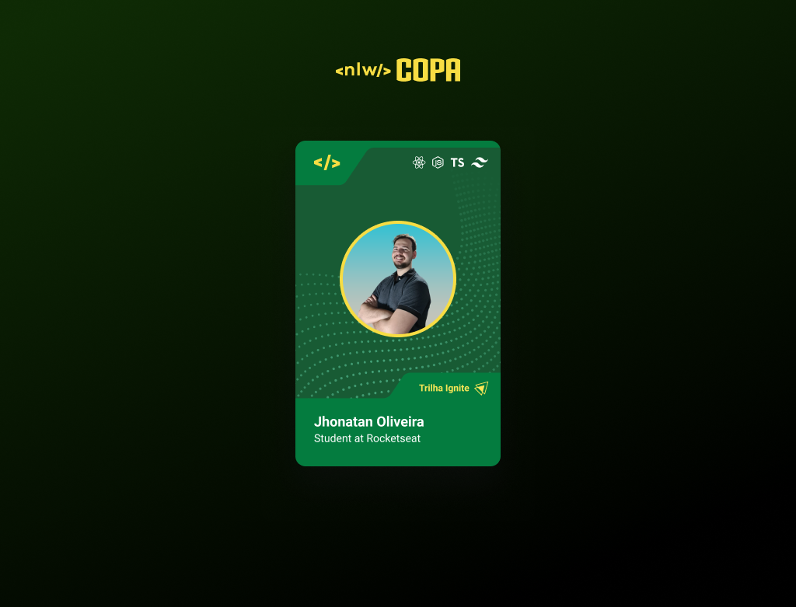

<h1 align="center">Scramble Game | Jogo de palavras embaralhadas  feito com JavaScript.</h1>

  <a href="#-tecnologias">Tecnologias</a>&nbsp;&nbsp;&nbsp;|&nbsp;&nbsp;&nbsp;
  <a href="#-projeto">Projeto</a>&nbsp;&nbsp;&nbsp;|&nbsp;&nbsp;&nbsp;
  <a href="#memo-licença">Licença</a>

 
  
  

    

 

  

# 📄 Descrição:

### O que foi desenvolvido?

- Um projeto simples utilizando HTML, CSS E JavaScript, feito com o auxílio do professor Mayk Britto, da Rockeseat durante o Aquecimento para o evento NLW Copa, da Rockeseat.

# 🚀 Tecnologias:

Esse projeto foi desenvolvido com as seguintes tecnologias:

### HTML5

### CSS3

### JavaScript

# 🚧 Projeto:

### [Confira aqui!](https://aquecimento-nlw-copa.vercel.app/)

# 🎨 Inspiração:

### [Aquecimento NLW Copa](https://www.youtube.com/watch?v=sswJisbD2CY&t=5s/)

# 📝 Licença:

Esse projeto é open source, idealizado e realizado pela Rocketseat.

Made by <a href="https://wwwjhonatan.oliveira.com/" target="_blank">Jhonatan Oliveira</a>.

